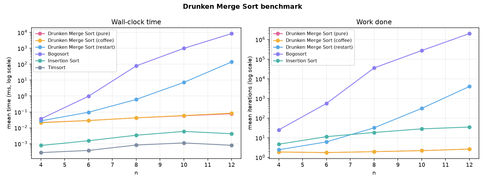

# 🍺 Drunken Merge Sort

A novelty sorting algorithm with a live animated visualizer.

The name is the joke, but it is also literally accurate: this really is a merge
sort — natural merge sort with the orderly left-to-right scan replaced by a
drunken stagger. The algorithm is real: elements start as singleton
**blocks**, the blocks *stumble* into a random new arrangement each step, and
any neighbours that happen to land in sorted order **fuse permanently** — they
"sober up" and never come apart again. Repeat until one block remains.

**This is an exploratory / educational piece, not a production algorithm.** It
is not fast, and — as the analysis below shows — in its pure form it usually
does not finish at all. That failure turned out to be the most interesting
thing about it, so this repo documents it honestly rather than hiding it.

---

## Watch it run

One real run of `[5, 3, 8, 1, 9, 6]`, replayed end to end. Lone elements are
grey; the moment blocks fuse they turn amber and a capsule closes around them;
the final fuse turns the whole array green.



That animation is generated by `make_demo_svg.py` from the algorithm's own
event log — a replay, not a mock-up. It is walked through move by move in
[A worked example](#a-worked-example-solved-step-by-step) below, and
`visualizer.html` is the interactive version of the same thing.

---

## The files

| File | What it is |
|---|---|
| `drunken_merge_sort.py` | The algorithm, with structured event logging for replay |
| `benchmark.py` | Drunken Merge Sort vs Bogosort vs Insertion Sort vs Timsort |
| `benchmark_results.md` | Generated results table (regenerate any time) |
| `benchmark_chart.png` | Generated log-scale time / work charts |
| `visualizer.html` | **The animated demo** — single file, no build step |
| `make_demo_svg.py` | Renders a real run into the animated SVG shown above |
| `demo.svg`, `demo_wedged.svg` | Generated replays: one successful run, one wedged |

### Quick start

```bash
python drunken_merge_sort.py -n 8 --seed 7 --trace    # watch one run in the terminal
python drunken_merge_sort.py -n 8 --seed 7 --coffee   # ...and let it finish
python drunken_merge_sort.py -n 10 --events run.json  # dump the replayable event list
python benchmark.py --chart                           # full sweep + PNG chart
python make_demo_svg.py                               # regenerate the README animation
```

Then just open `visualizer.html` in any browser — no server, no dependencies.

---

## How it works

A **block** is a contiguous logical group with a min, a max, and an internally
sorted list of elements. Every value starts as its own block. Then, each step:

1. **Stumble.** Randomly permute the *sequence of blocks*. Blocks move as whole
   units — once values are inside a block they never separate.
2. **Fuse.** Scan for adjacent blocks `A, B` where `max(A) <= min(B)` and fuse
   them into one block (plain concatenation is already sorted). Repeat the scan
   until no fusible adjacent pair remains. Fusions are permanent.
3. **Absorb.** If a lone unfused element's value falls strictly between the min
   and max of an *adjacent* block, slot it into that block at its correct
   internal position.
4. Repeat until one block remains — that block is the sorted array.

The implementation is split exactly along those lines: `shuffle_blocks()`,
`scan_and_fuse()`, `absorb_singletons()`, `settle()` (fuse + absorb to
fixpoint), and `drunken_merge_sort()` as the main loop. A seed makes any run
reproducible, and `max_stumbles` is the safety cap — exceed it and Drunken Merge Sort
*passes out* and reports failure gracefully instead of spinning forever.

Every state change is appended to a structured event list (`init`, `shuffle`,
`fuse`, `absorb`, `coffee`, `sorted`, `passed_out`), each carrying a full
snapshot of the arrangement after the event. That list is what a replay-based
animation consumes.

---

## A worked example, solved step by step

Input `[5, 3, 8, 1, 9, 6]` with seed 59 — the run in the animation above.
Follow along with:

```bash
python drunken_merge_sort.py --values 5,3,8,1,9,6 --seed 59 --trace
```

**Start.** Every element is its own block:

```
[5] [3] [8] [1] [9] [6]                                     6 blocks
```

### Stumble 1 — the lucky one

Shuffle the six blocks into a random new order:

```
[6] [8] [9] [1] [5] [3]
```

Now settle. The fuse pass scans left to right for an adjacent pair `A, B` with
`max(A) <= min(B)`, fuses the first one it finds, and restarts the scan:

| scan | pair examined | test | arrangement after |
|---|---|---|---|
| 1 | `[6]`, `[8]` | 6 ≤ 8 ✔ | `[6,8] [9] [1] [5] [3]` |
| 2 | `[6,8]`, `[9]` | 8 ≤ 9 ✔ | `[6,8,9] [1] [5] [3]` |
| 3 | `[6,8,9]`, `[1]` | 9 ≤ 1 ✘ | — keep scanning |
| 3 | `[1]`, `[5]` | 1 ≤ 5 ✔ | `[6,8,9] [1,5] [3]` |
| 4 | `[1,5]`, `[3]` | 5 ≤ 3 ✘ | no fusible pair left |

Then the absorption pass. `[3]` is a lone element sitting next to `[1,5]`, and
`1 < 3 < 5` — *strictly* inside its range — so it drops into that block at its
correct internal index:

```
[6,8,9] [1,3,5]                                             2 blocks
```

One shuffle bought three fusions and an absorption: 6 blocks down to 2.

### Stumble 2 — the wasted one

```
[6,8,9] [1,3,5]
```

The shuffle happened to land on the order it was already in. `9 ≤ 1` is false,
so nothing fuses, and neither block is a lone element, so nothing absorbs. The
whole step is a loss — this is the gamble that dominates the algorithm's cost.

It is *not* wedged, though. `5 ≤ 6`, so the **other** ordering of these two
blocks does fuse; `is_wedged()` sees that and lets the run carry on.

### Stumble 3 — the finish

```
[1,3,5] [6,8,9]        max 5 ≤ min 6 ✔        →     [1,3,5,6,8,9]
```

One block remains, so that block is the sorted array:

```
output: [1, 3, 5, 6, 8, 9]
status: Sorted in 3 stumbles.
blocks over time: [6, 2, 2, 1]
correct: True
```

Three stumbles for six elements. That is the *good* case — and the next section
is about why you should not expect it.

---

## The honest part: Drunken Merge Sort usually gets stuck

Not "slow". **Stuck.** Permanently, in a way no amount of extra shuffling can
fix.

Fusion is greedy and irreversible, so a run can easily build two blocks whose
value ranges *nest* — say `[1,10]` and `[4,6]`:

* `[1,10]` then `[4,6]` → `max = 10 > 4 = min`. No fuse.
* `[4,6]` then `[1,10]` → `max = 6 > 1 = min`. No fuse.
* Neither is a lone element, so absorption cannot apply either.

Blocks only ever grow, so this state never changes. The run is **wedged**.

Stated cleanly:

> A run is wedged **iff** two or more blocks remain, none of them is a
> singleton, and every pair of block ranges overlaps.

(The "no singleton" clause follows from the rest: with distinct values, a lone
element whose range overlaps a block's range is by definition strictly inside
it, and so is absorbable.)

`is_wedged()` checks this directly, which lets a hopeless run fail in
milliseconds instead of burning the full iteration cap. Measured success rate
of the pure algorithm, 2000–4000 random arrays per size:

| n | 4 | 6 | 8 | 10 | 12 | 14 | 16 | 20 |
|---|---|---|---|---|---|---|---|---|
| **sorted** | 81% | 29% | 6.4% | 0.55% | ~0% | ~0% | ~0% | ~0% |

Past n = 10, pure Drunken Merge Sort essentially never sorts anything. The greedy
fusion that makes early progress feel fast is exactly what drives it into a
dead end: fusing `[1]` with `[10]` is legal, instant, and ruinous, because it
creates a wide-ranged block that overlaps almost everything left.

### The same array, one seed away

The worked example above sorted `[5, 3, 8, 1, 9, 6]` in three stumbles. Change
nothing but the seed and the identical input dies after two:

```bash
python drunken_merge_sort.py --values 5,3,8,1,9,6 --seed 1 --trace
```


```
[5] [3] [8] [1] [9] [6]

stumble 1  →  [8] [1] [6] [5] [9] [3]
     fuse [1] + [6] = [1,6]       1 ≤ 6 ✔      ← the fatal move
     fuse [5] + [9] = [5,9]       5 ≤ 9 ✔
                                               [8] [1,6] [5,9] [3]

stumble 2  →  [8] [5,9] [1,6] [3]
     absorb 8 into [5,9]          5 < 8 < 9 ✔  [5,8,9] [1,6] [3]
     absorb 3 into [1,6]          1 < 3 < 6 ✔  [5,8,9] [1,3,6]
```

Two blocks left, and that is the end of the road. Every legal move has been
checked and none of them exist:

* `[5,8,9]` then `[1,3,6]` → `max = 9 > 1 = min`. No fuse.
* `[1,3,6]` then `[5,8,9]` → `max = 6 > 5 = min`. No fuse.
* Neither block is a lone element, so absorption cannot apply.

Those are the only two arrangements of two blocks, and blocks never shrink, so
no future stumble can produce anything new. That is exactly the condition
`is_wedged()` tests, which is why this run gives up after two stumbles instead
of ten thousand.

The fatal move was fusing `[1]` with `[6]` on the very first stumble: legal,
instantly profitable, and it builds a block spanning 1–6 that straddles the 5
inside `[5,9]`. From that moment the two can never fuse in either order — the
run is already dead at the end of stumble 1, even though `is_wedged()` still
says `False`, because the lone 8 and 3 have legal absorptions left to make.
Those absorptions are the last two moves of a lost game: exhaustively expanding
every shuffle from `[8] [1,6] [5,9] [3]` reaches 19 distinct states, and not one
of them is sorted.

Both rescue variants recover this exact run; coffee does it in place:

```bash
python drunken_merge_sort.py --values 5,3,8,1,9,6 --seed 1 --trace --coffee

# ...
#   coffee [5, 8, 9] + [1, 3, 6] = [1, 3, 5, 6, 8, 9]
# output: [1, 3, 5, 6, 8, 9]
# status: Sorted in 2 stumbles.
```

### Two ways to make it a sorting algorithm again

* **`restart`** — a wedge means "sober up and start the night over". Retries
  until it gets lucky. Terminates with probability 1.
* **`coffee`** — when wedged, allow exactly one *interleave* merge of two
  adjacent blocks. Guarantees termination and is the variant the visualizer
  offers you when it passes out.

---

## Benchmark results

From `benchmark.py` (seed 20260830). Full tables in `benchmark_results.md`.



**Work done (mean iterations per run):**

| n | Drunken Merge (pure) | Drunken Merge (restart) | Bogosort | Insertion (comparisons) |
|---|---|---|---|---|
| 4 | 2 | 2 | 25 | 5 |
| 6 | 2 | 6 | 554 | 11 |
| 8 | 2 | 32 | 35,703 | 19 |
| 10 | 2 | 313 | 275,065 | 28 |
| 12 | 3 | 4,064 | 2,000,000 (cap, DNF) | 35 |

**Wall-clock (mean ms per run):**

| n | Drunken Merge (pure) | Drunken Merge (restart) | Bogosort | Insertion | Timsort |
|---|---|---|---|---|---|
| 4 | 0.024 | 0.030 | 0.037 | 0.001 | 0.000 |
| 8 | 0.042 | 0.618 | 81.3 | 0.003 | 0.001 |
| 10 | 0.062 | 8.45 | 1055.3 | 0.007 | 0.001 |
| 12 | 0.085 | 145.7 | 8933.1 | 0.006 | 0.001 |

### Does Drunken Merge Sort scale worse than Bogosort?

The natural guess going in was yes. **The data says no — and it is worth being
precise about why, rather than repeating the guess.**

Two things have to be separated:

**1. Per-attempt cost is tiny and barely grows.** A pure run ends after ~2–3
stumbles at every size tested. It is not a slow random search; it is a fast
one-shot gamble that usually loses. Its cost is *completion probability*, not
time. Comparing its wall-clock time to Bogosort's is meaningless, because most
of those runs did not sort anything.

**2. The fair race is `restart` vs Bogosort** — both are then honest
shuffle-until-lucky algorithms. There, Drunken Merge Sort wins, and by a widening
margin: at n = 12 it needs ~4.3k stumbles against Bogosort's expected
12! ≈ 4.8 × 10⁸ shuffles, five orders of magnitude apart. Measured totals grow
by roughly ×3.6 per added element, i.e. about **Θ(c ⁿ) with c ≈ 3.5**, whereas
Bogosort is **Θ(n · n!)**. Since `cⁿ = o(n!)`, restart-Drunken Merge Sort beats
Bogosort asymptotically, not just at these sizes.

The mechanism is a **ratchet**. Bogosort's test is all-or-nothing: a permutation
that is one swap from sorted scores exactly as badly as a maximally scrambled
one, and all progress is thrown away every iteration. Drunken Merge Sort keeps its
partial luck — every fusion permanently shrinks the number of units to be
permuted, so each stumble is a cheaper gamble than the last. Drunken Merge Sort is
roughly "Bogosort with memory".

The catch, and the real lesson: **the same ratchet is what kills it.** Retained
progress is retained *irreversibly*, so a greedy fusion can ratchet the run
into a state with no legal moves left. Bogosort is stupid but can never get
stuck; Drunken Merge Sort is cleverer and pays for it with a termination failure. That
trade — memory buys speed, irreversibility costs completeness — is the actual
takeaway, and it is a genuinely common shape in greedy and randomized
algorithms.

None of this makes Drunken Merge Sort useful. Insertion sort does n = 12 in 35
comparisons and Timsort in a microsecond, both about 10⁵ times cheaper than the
restart variant while always succeeding.

### What a "sober" version looks like

Drop the shuffle. Scan left to right exactly once, fusing adjacent runs as you
find them:

```python
def sober_sort(values):          # `merge` is the standard two-pointer merge
    # Step 1: find the natural ascending runs already present.
    runs, current = [], [values[0]]
    for v in values[1:]:
        if v >= current[-1]:
            current.append(v)          # the run continues
        else:
            runs.append(current); current = [v]
    runs.append(current)

    # Step 2: merge neighbouring runs pairwise until one remains.
    while len(runs) > 1:
        runs = [merge(runs[i], runs[i+1]) if i+1 < len(runs) else runs[i]
                for i in range(0, len(runs), 2)]
    return runs[0]
```

That is **natural merge sort** — `O(n log n)` worst case, `O(n)` on
already-sorted input. Drunken Merge Sort is structurally the same algorithm with two
changes: the deterministic left-to-right scan is replaced by a random
permutation, and the general merge is restricted to the special case where the
runs happen to be disjoint (`max(A) <= min(B)`), which is why it needs luck at
all. Coffee mode restores the general merge — which is precisely why it
restores termination.

So the punchline: **Drunken Merge Sort is natural merge sort that refuses to look where
it is going.**

---

## The visualizer

`visualizer.html` — one file, embedded CSS/JS, no dependencies. Open it
directly.

Every state change is *animated*, never snapped:

* **Stumbles** slide blocks to their new positions with eased CSS transforms,
  with a slight wobble on the bars so it reads as a stumble rather than a cut.
* **Fusions** play in beats: the pair glows and breathes → slides together,
  closing the gap between them → flashes and pulses as one block → settles with
  a new shared colour.
* **Absorptions** lift the lone element while it looks for its slot, then drop
  it into its correct internal index with a squash-and-stretch snap-in bounce
  as its neighbours shift aside.
* Animations are **strictly sequenced** — an `async/await` engine finishes the
  shuffle before any fusion plays, and on Play the next stumble only begins
  once the current step has fully settled. Resetting mid-animation invalidates
  the in-flight sequence with a generation token, so nothing overlaps.

Also included: stumble / blocks-remaining / fusion counters, a **sobriety
meter** that fills as blocks fuse, a live event feed whose lines slide in as
each event happens, an animated **"passed out"** overlay when the run wedges
(with a *Pour coffee* button that un-sticks the run in place), and controls for
play/pause, single step, reset, animation speed, array size (4–14) and seed.

Reduced-motion preferences are respected.

### The README animations

`make_demo_svg.py` is the non-interactive counterpart: it takes one run's event
list and compiles it into a single self-contained SVG — CSS keyframes only, no
script, no external assets — so GitHub animates it inline. Bar positions and
colours, the block capsules, the captions and the block counter are all
keyframed off the same event timeline the HTML visualizer replays, which is why
the picture and the trace can never disagree. Point it at any run:

```bash
python make_demo_svg.py --values 5,3,8,1,9,6 --seed 59 --out demo.svg
python make_demo_svg.py --values 5,3,8,1,9,6 --seed 1 --out demo_wedged.svg
python make_demo_svg.py --values 5,3,8,1,9,6 --seed 1 --coffee --out demo_coffee.svg
```

It honours `prefers-reduced-motion` too, freezing on the first frame.

---

## What it's for

It is a decent vehicle for a few real ideas:

* Randomized algorithms whose expected cost is dominated by *success
  probability* rather than per-iteration work.
* Why irreversible greedy choices can destroy completeness — and how to detect
  a dead state directly (`is_wedged`) rather than waiting for a timeout.
* How a silly rule set can be one deletion away from a serious algorithm.
* Animation sequencing: driving a visual timeline from a structured event log.

Not for: sorting anything.

---

## Notes and limitations

* Values are assumed **distinct**. Fusion (`<=`) handles duplicates fine, but
  the absorption rule's strict betweenness never fires on an equal value, so
  duplicates only ever slow it down.
* `max_stumbles` defaults to 10,000 in Python and 300 in the visualizer. In
  practice the cap almost never triggers — wedge detection fires first.
* The `restart` variant's growth constant (c ≈ 3.5) is fitted from n ≤ 12 and is
  empirical, not proved.
* Benchmark timings are from one machine (CPython 3.12, Windows); the relative
  ordering is the meaningful part, not the absolute milliseconds.
